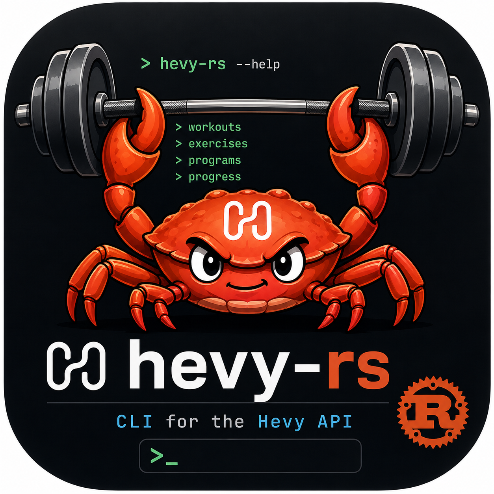

# hevy-rs

<p align="center">
  
</p>

Give your [AI coach](CONTEXT.md#language) safe, structured access to your Hevy workouts,
routines, and progress. `hevy-rs` is a Rust CLI plus a bundled agent skill for accessing
Hevy data—it is not a coaching product and does not provide fitness advice.

[](https://github.com/diegaccio/hevy-rs/actions/workflows/ci.yml)
[](https://crates.io/crates/hevy-rs)
[](LICENSE-APACHE)

## Use with your AI coach

An AI coach is a user-selected external agent that provides fitness guidance. The CLI and
bundled `hevy-rs` skill give it structured access to Hevy data; choose and trust your own
agent and model provider, and review their data practices before sharing data with them.

The CLI and skill also give an agent a ready-made command and safety reference, so it can
use structured Hevy operations instead of repeatedly discovering API details from the
documentation—saving context and token use.

1. Install [Rust and Cargo](https://rustup.rs/) if needed, then install the released CLI on
   the host where your agent runs:

   ```sh
   cargo install hevy-rs --locked
   ```

   The `hevy-rs` command must be on that host's `PATH`.

2. Install the bundled skill with the agent-neutral skills installer:

   ```sh
   npx skills add diegaccio/hevy-rs --skill hevy-rs
   ```

3. Configure your Hevy API key in the agent host's environment—not in a chat prompt:

   ```sh
   export HEVY_API_KEY='your-api-key'
   ```

4. Restart, or open, your compatible agent so it can discover the CLI and skill.

Start safely with a read-only prompt:

> Review my last four Hevy workouts and identify one progression opportunity. Do not make
> any changes to my Hevy account.

For a routine change, keep drafting separate from writing. First ask your AI coach:

> Draft a routine for my stated goal using my recent Hevy workouts. Show the exact proposed
> routine and do not create or update anything yet.

Review the proposal. Only then give fresh, explicit approval of that exact plan, for example:

> I approve creating exactly the routine shown in your previous message: **[paste the exact
> approved plan]**. Create it now.

The bundled skill requires this fresh approval before a mutation.

## Use the CLI directly

You can use `hevy-rs` without an agent skill. Set the key in your environment, then make a
safe first read:

```sh
export HEVY_API_KEY='your-api-key'
hevy-rs user get
```

Use JSON for scripts and other machine consumers:

```sh
hevy-rs --format json user get
```

The command tree is resource-first; inspect help before using an unfamiliar operation:

```sh
hevy-rs --help
hevy-rs workouts --help
hevy-rs workouts create --help
```

## Documentation

- [Command, configuration, safety, recovery, and fixture reference](docs/reference.md)
- [Human command-discovery walkthrough](docs/walkthroughs/discovery.md)
- [Evidence-to-advice walkthrough](docs/walkthroughs/evidence-to-advice.md)
- [Proposal-to-write walkthrough](docs/walkthroughs/proposal-to-write.md)
- [Ambiguous-write recovery walkthrough](docs/walkthroughs/ambiguous-write-recovery.md)
- [hevy-rs agent skill](skills/hevy-rs/SKILL.md)
- [Release policy and maintainer procedure](docs/releasing.md)

## Compatibility

`hevy-rs` is pre-1.0: verify your installed command contract with `hevy-rs --help`.
The public Hevy API may change.

## License

Licensed under either of

- [Apache License, Version 2.0](LICENSE-APACHE), or
- [MIT license](LICENSE-MIT)

at your option.
